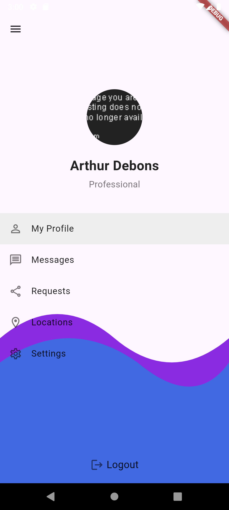

# User Profile UI

This Flutter project implements a user profile UI based on a provided design.

## Features

- **Custom Curved Background**: A visually appealing curved background is implemented using `CustomPainter` to match the design.
- **Profile Section**: Displays the user's profile picture, name (`Arthur Debons`), and title (`Professional`).
- **Menu Section**: A `ListView` provides a list of menu options:
  - My Profile
  - Messages
  - Requests
  - Locations
  - Settings
- **Logout Button**: A dedicated logout button is included at the bottom of the screen.

## Screenshot

Here's a screenshot of the application:

| Screenshot |
| :---: |
|  |

## Getting Started

This project is a starting point for a Flutter application.

A few resources to get you started if this is your first Flutter project:

- [Lab: Write your first Flutter app](https://docs.flutter.dev/get-started/codelab)
- [Cookbook: Useful Flutter samples](https://docs.flutter.dev/cookbook)

For help getting started with Flutter development, view the
[online documentation](https://docs.flutter.dev/), which offers tutorials,
samples, guidance on mobile development, and a full API reference.
